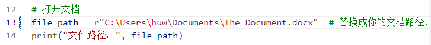
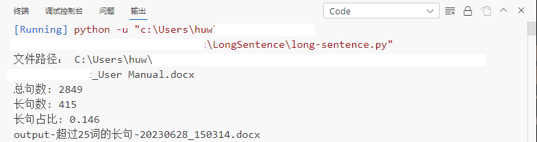

# 长句检测

## 概述

该脚本是一个使用Python开发的脚本，可统计并提取英文文档中超过**25**个单词的长句数量，并自动生成一个Microsoft word (.docx)文档来保存提取出的长句。  
当前脚本支持.**docx,.txt和.html** 这3种格式的**英文**文档。

## 目录结构
```
   long-sentence.py
   example-image
        open-doc.png
        result.png
   README.md
   requirements.txt
   LICENSE
```

## 内容列表 
- [概述](#概述)
- [目录结构](#目录结构)
- [内容列表](#内容列表)
- [背景](#背景)
- [功能](#功能)
- [环境](#环境)
- [前提](#前提)
- [用法](#用法)
- [支持](#支持)
- [贡献](#贡献)
- [开源协议](#开源协议) 

## 背景  

句子长度是影响技术文档质量的一个重要因素。文档中的长句越多，可读性和易用性越差。  

本脚本将英文文档中句长超过**25**个单词的句子，定义为长句。  

此脚本可以检测文档中的长句数量和比例，输出详细的数据。


## 功能  

* 统计文档中的句子总数。  
* 统计文档中超过25个单词的长句总数。  
* 统计长句在整个文档中的占比。
* 提取长句并保存到Word文档中（Word文档和脚本处于同一路径）。

## 环境  
- 脚本须在Windows操作系统中运行。
- 主机上已经安装了能够运行python脚本的程序，如集成了Python 解释器的Visual Studio Code。


## 前提

- 在Command Prompt 终端，通过 `pip install` 命令安装 requirements.txt包含的第三方模块。如下所示：  

   > pip install -r requirements.txt    


## 用法 

1. 将需要检测的英文文档放入指定文件夹，并复制文档路径。例如：  

   >C:\Users\huw\Documents\The Document.docx
  

2. 打开脚本，将第1步中复制的文档路径，粘贴到 file_path，以读取文档。如下图所示：  

   


   
3. 运行脚本，查看输出结果。同时，在脚本所在目录下生成一个名为 **output-超过25词的长句-时间戳.docx** 的Word文档。  如下图所示：  

   

  
   >**注意：** 脚本调用了第三方库，检查的结果无法完全排除误差的可能性。如果要将检查结果用于专业目的，建议人工对结果进行复核。  

## 支持

-   邮箱：hui.wang@sigmatechnology.com

## 贡献

非常欢迎你的加入！你可以通过[Open Issue](https://github.com/Sigma-China/tools-and-scripts/issues/new "Open Isuuse") 或 pull request的方式来共同开发。

## 开源协议

[MIT](LICENSE)


